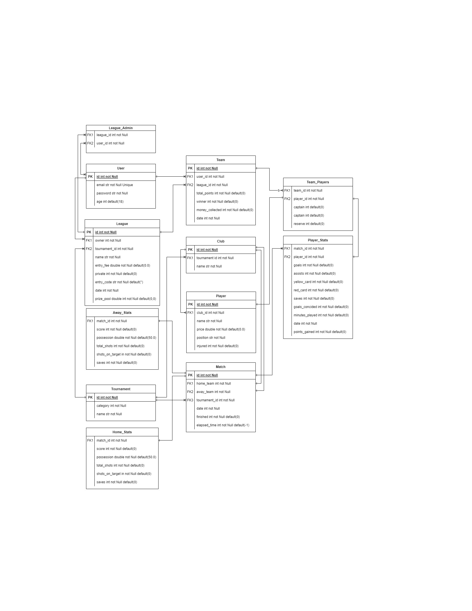

This is a repository for my very own Fantasy Soccer API. I created this to practice on how to design and build a proper API that can be used as a service in the industry.
Below I have tried to provide some details about the project like its design and the tech stack I used. I hope you enjoy!

# Database
  I designed the database keeping in mind already existing services like FPL(Fantasy Premier League). Mostly the design of the database will give a service similar to FPL , but I have designed it in a way that won't restrict users to only have a single team for every league they join.  Besides that owners of the API can configure it to make the amount of players per team from 5 upto 16(like the classic FPL) , all you need to do is tweek the `MIN_PLAYERS` variable in `app/services/validator.py`.
  
  I doubt that the database design of FPL will be remotely close to this , it is quite complex , but I have tried my best to mimick its services and to normalize all of my tables.
  
  

# API End-Points
  The available endpoints are a lot so I have published somewhat of a documentation of them using postman. You can find the documentation [here](https://documenter.getpostman.com/view/22836066/2sA2r535HQ).
  
# Tech-Stack
  * `fastAPI` : to create this API.
  * `SQLAlchemy` : as the ORM.
  * `SQLite` : as the databse , but since I used an ORM you can use anyother DBSM inplace of it. Just make sure that the Databse you create has the same naming , tabel relationships and columns.
  * `uvicorn` : an ASGI server for serving the fastAPI app.   
  
# How to run
  After cloning this repository navigate to `app` then run the command `uvicorn main:app`.
  * Note : I know I haven't provided the requirements , the main ones are  `pydantic` , `uvicorn` , `fastAPI` and `SQLite`. 
